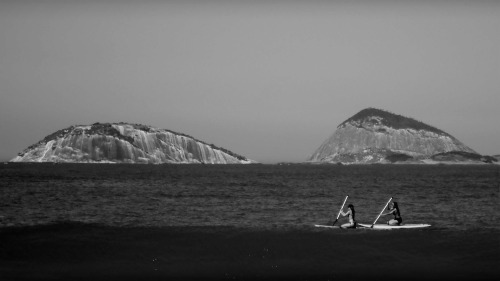

## Bruno Buccalon

Technical assistant at the [Instituto Moreira Salles](https://ims.com.br)' photography department, currently working with [Rice University](https://hrc.rice.edu/situatedviews/). Holds a BA in Archictecture and Urban Planning from [Escola da Cidade](http://escoladacidade.org/) (2017). Studies archives and visual culture.

*Assistente técnico na coordenação de fotografia do Instituto Moreira Salles, atualmente trabalhando com a Universidade de Rice. Graduado em arquitetura e urbanismo pela Escola da Cidade (2017). Estuda arquivos e cultura visual.*
